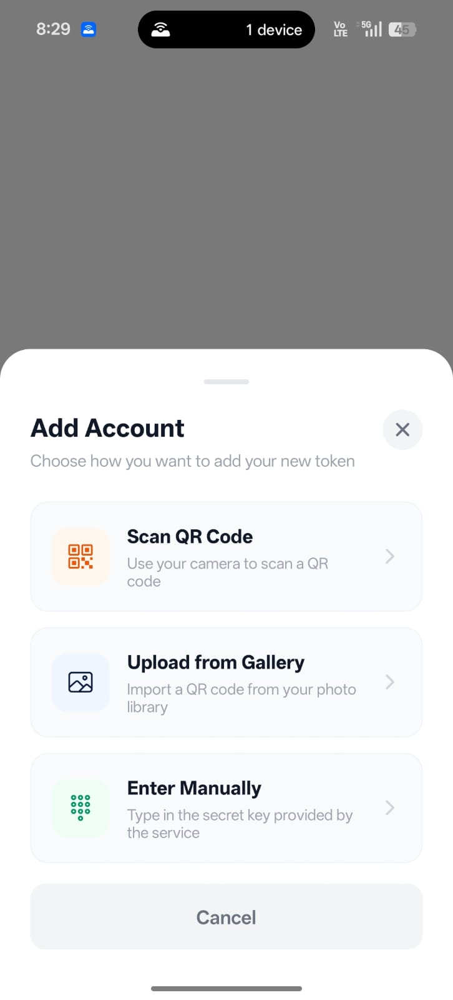
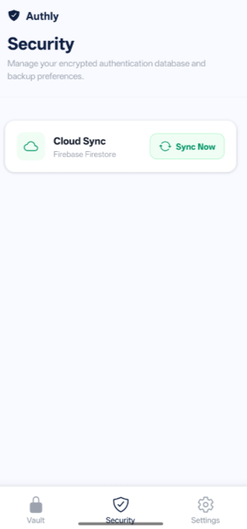
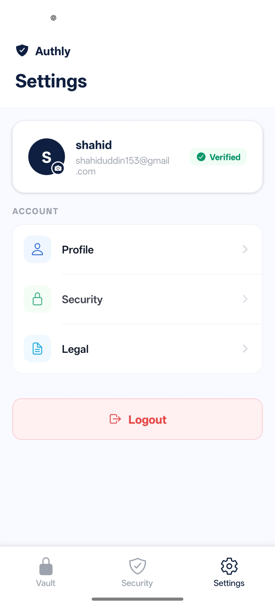

# Authly – Secure 2FA Authenticator App

## Overview

Authly is a modern, secure, and minimal 2-Factor Authentication (2FA) mobile application built using React Native (Expo) and Node.js.

It allows users to securely store their 2FA accounts, generate real-time OTP codes, scan QR codes, and sync data with Firebase Firestore.

---

## Features

### Authentication

- Email + Password Signup/Login
- OTP verification via email (Nodemailer)
- Forgot Password & Reset flow

### 2FA Vault

- Add accounts via QR code scanning
- Manual secret key entry
- Real-time TOTP generation (30s refresh)
- Copy OTP instantly
- Edit and delete accounts

### Cloud Sync

- Firebase Firestore integration
- Secure per-user storage

---

## Tech Stack

### Frontend

- React Native (Expo)
- TypeScript
- Expo Router
- AsyncStorage
- Axios

### Backend

- Node.js
- Express.js
- Firebase Admin SDK
- Firestore Database

### Security & Utilities

- otplib (TOTP)
- bcryptjs (password hashing)
- nodemailer (OTP email)
- jsQR (QR scanning)
- sharp (image processing)
---

## 📱 App Screenshots

  
  
  

  
  
  

---

## Author

Shahiduddin (Shaho) – VCET Vasai
